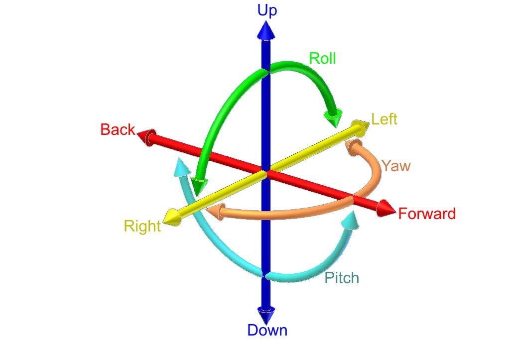

# DIY-Drone
This project is for ECE 1895 - Junior Design Fundamentals.

### Background
A quadacopter drone can move in the any direction and rotate on any axis. To start off the rotation:  
* X-axis is the pitch that would cause a up-down motion. 
* Y-axis is the roll that would cause a left to right motion.
* Z-axis is the yaw that would cause a tilting motion.  
 
Figure 1

Depending on what you define as the axis the pitch, roll, and yaw may vary. In this project, x-axis is yellow, the red is y-axis, and z-axis is blue.

## Design Overview

### Introduction

This project aims to use Teensy 4.1, LSM6DSOX, MPL3115A2, and a GPS module to make a DIY flight controller. All of this is to develop a flight controller that is more modular and flexible than pre-built ones for the Robotics and Automation Society (RAS) Aerial Project. The goal is to make one that can be used on a bigger platform.

The flight controller is designed to incorporate a receiver, gyroscope, accelerometer, barometer, GPS, and FPV camera. This comprehensive setup allows for flight control, orientation and altitude monitoring, and manual control. The LSM6DSOX and MPL3115A2 sensors play a crucial role in determining the drone's direction, orientation, and altitude.

In the end, I got the receiver, gyroscope, accelerometer, and barometer to work correctly in terms of getting the data from the sensors and calculating the data into something I can use.

Right after bop-it had finished, I started getting some data from the receiver, and within the week, I got it to work correctly and tested it. Then, I waited a week because I submitted the BOM late. Once I received all of my sensors and components, I tested the LSM6DSOX sensor and the MPL3115A2 sensor individually to see if the sensors were working correctly. Both the LSM6DSOX and MPL3115A2 worked fine, so I implemented sample collection to calibrate the sensors. The LSM6DSOX and MPL3115A2 are vital parts of a flight controller; with other classes, assignments, and exams, I could get a digital filter and a PID controller working.

## Preliminary Design Vefificaiton 
I breadboarded all of the circuit for the flight controller.

Figure 2

On the breadboard is the from top to the bottom are the receiver, MPL3115A2, LSM6DSOX and Teensy 4.1. 

The test plan was to plug it into the Teensy and check if the values read in and check those values in the serial monitor from the Arduino IDE. 

For the LSM6DSOX: https://youtu.be/Ty-h-1SDryA
This works and it is very responsive.

For the MPL3115A2: 
Figure 3

## Design Implementation
The Final design of the drone project was all breadboarded because of the time constraints and getting everything to work together.

Figure 4

Figure 5

As shown in Fig. 3 the breadboad (flight controller) is zip tied to the cassy of the drone. All the electronic speed controllers (ESC) are connected to the pins 1-4, which are PWM pins. 

## Design Testing
During the testing of the two vital components of the drone (LSM6DSOX and MPL3115A2). I have encountered problems with MPL3115A2, where zeroing out the altitude is not working, no matter how I approach it. Whether it is to go into the library and create a zero function or manually zero it out in the code, it will not work. By the time of the final integration with the receiver and the LSM6DSOX, it caused a delay within the program where it would make the receiver commands slow, thus making it step instead of a smooth curve. With the given time, the solution was not to use MPL3115A2 and get the LSM6DSOX. However, I am planning to continue using the MPL3115A2 over the summer and see if I can find a solution. While debugging this sensor, I read the data sheet and saw if my application's default library was set up. From what I can tell, it was.

The LSM6DSOX worked as I expected,, and there werewere no issues during the testing and integration with the receiver. From there, I implemented a Kalman filter and a PID controller to control the motors' PWM.

For the receiver, I had no issues with it, even during the integration, as it printed out the values I would need, and it controlled the motors well. As shown in this video: https://youtube.com/shorts/3NB_AB9C-Os?feature=share

Overall, the motors did spin, and only the roll worked as expected, while the pith and yaw of the motors did not. The issue can be software because the ESC depends on the PWM signal the teensy sends. It would either be the PID controller causing the motors to not respond to the change in the commands or the filter. This suspicion was based on the receiver getting the commands for the pitch and yaw change. However, it is not changing on the motors. During the debugging phase, I saw that the PWM output was changing according to the joystick, but it was not getting to the motor correctly. 

## Summary, Conclusions and Future Work
In conclusion, I have learned a lot about implementing I2C and SPI communication. I learned how to apply a digital filter and make a PID controller from there. However, I could not get the drone to have full functionality. I was able to get the drone to respond to some commands. 

In the future, I will work on it for more than six weeks because of other class assignments and exams. Solely focusing on making the flight controller would be very challenging unless you have previous experience with embedded communication or something in control theory and digital filtering. I have learned how to implement the filters, but I need more time and research.